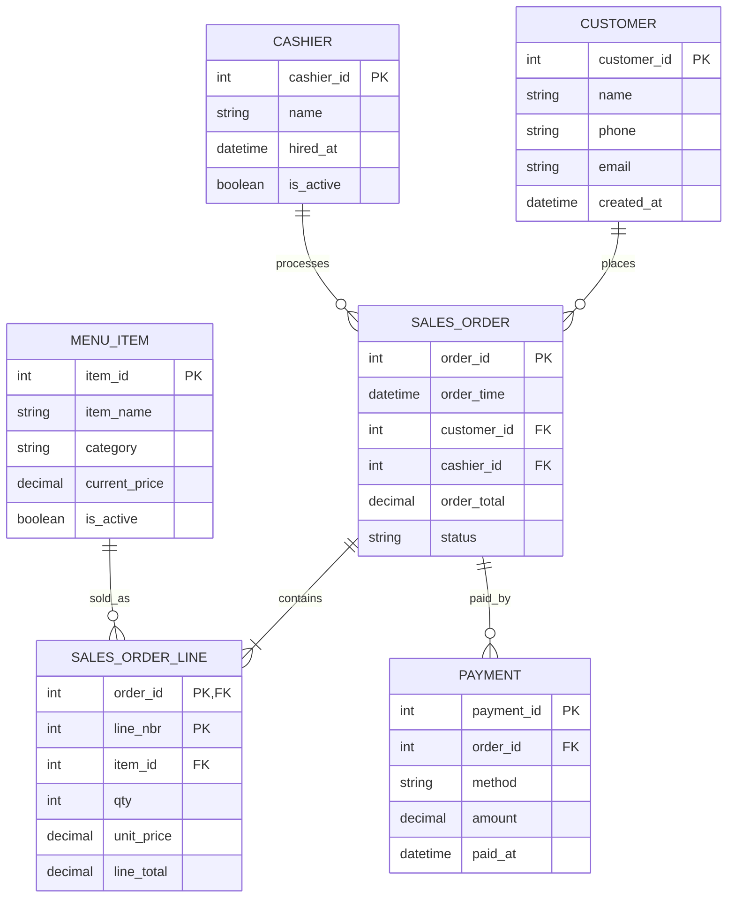

# Cafeteria POS — Data Modeling “Hello World” (Beginner Friendly)

## Scenario (simple words)
A small cafeteria sells food and drinks. A cashier creates an order when a customer buys something.  
Each order can contain multiple items (e.g., coffee + sandwich) and the customer pays (cash or card).  
The café wants to store this data to answer questions like: **“How much did we sell today?”** and **“What items are most popular?”**

---

## Step 1 — Identify entities (tables) and attributes (columns)
To store the business data in a database, we first identify the “things” we need to store:

- **Customer** (who buys)
- **Order** (the purchase event)
- **Order Line** (the items inside an order)
- **Payment** (how the order was paid)
- **Menu Item** (the products sold)

**Entity = Table** (a “thing”)  
**Attribute = Column** (a detail about the thing)

---

## Step 2 — A typical beginner model (with intentional mistakes)
Beginners often try to store everything inside one table.

### ❌ Naive table: `orders`
| Column | What it means |
|---|---|
| `order_id` (PK) | unique order number |
| `order_time` | when the order happened |
| `customer_id` | customer identifier |
| `customer_name` | customer name |
| `customer_phone` | customer phone |
| `cashier_name` | cashier who processed the order |
| `items` | text like `"Coffee x2, Sandwich x1"` |
| `total_amount` | total money for the order |
| `payment_method` | cash / card |

---

## Step 3 — Why this model is wrong (linking to normalization)

### 1NF problem: “lists inside a cell”
The column `items = "Coffee x2, Sandwich x1"` violates **1NF** because one cell contains multiple values.
- Hard to query: “How many coffees were sold?”
- Hard to validate: you must parse text

### 3NF problem: attributes that depend on non-key attributes (transitive dependency)
Assume the primary key is `order_id`.

In this table:
- `order_id → customer_id` (each order belongs to one customer)
- `customer_id → customer_name, customer_phone` (customer details are determined by the customer)

So:
`order_id → customer_id → customer_name`

This means `customer_name` and `customer_phone` do **not** depend directly on the primary key (`order_id`).  
They depend on another non-key attribute (`customer_id`) → this is a **3NF violation** (transitive dependency).

**Practical consequence:** customer details repeat in many orders and can become inconsistent when data changes.

---

## Step 4 — Fix direction (what normalization leads us to)
To fix the issues we separate data into tables where each table stores facts about one entity.

### ✅ Better entity split (high level)
- `customer(customer_id, name, phone, ...)`
- `sales_order(order_id, order_time, customer_id, cashier_id, ...)`
- `sales_order_line(order_id, line_nbr, item_id, qty, unit_price, ...)`
- `payment(payment_id, order_id, method, amount, ...)`
- `menu_item(item_id, item_name, current_price, ...)`

This structure:
- fixes **1NF** by putting each item on its own row in `sales_order_line`
- moves customer details to the `customer` table to support **3NF**
- makes analytics and reporting much easier

---



## Key takeaways
- **1NF**: don’t store lists inside a single column (no repeating groups).
- **3NF**: avoid transitive dependency (non-key columns should not depend on other non-key columns).
- Good models reduce duplication, prevent update anomalies, and make querying easier.


Alright — think of your current ER model as **OLTP** (optimized for correct inserts/updates). To go to an **analytics schema** (optimized for fast GROUP BYs), you typically convert it into a **dimensional model** (Star Schema).

### 1) First decision: what questions do you want to answer?

For a cafeteria POS, the usual analytics are:

* Sales per day / hour / week
* Most popular items
* Average basket size
* Cashier performance
* Payment mix (cash vs card)
* Repeat customers / cohorts

### 2) Define the *grain* (this is the key step)

Pick the “atomic event” you want each fact row to represent.

Best default grain here:

* **One row per sold item per order line**
  (i.e., your `sales_order_line` becomes the core fact)

Why? Because “How many coffees did we sell?” becomes trivial.

### 3) Identify Facts vs Dimensions

**Facts = events + numeric measures**
**Dimensions = descriptive context used to slice facts**

#### Fact candidates

* **Sales** at line level → quantities, revenue, discounts, etc.
* **Payments** at payment transaction level → amount by method (important if split payments exist)

#### Dimension candidates

* Customer, Item, Cashier, Date, Time, Payment Method (and optionally Store/Terminal if you have it later)

### 4) Map from your ER tables to Star Schema

* `sales_order_line` → **fct_sales_line** (main fact)
* `sales_order` → provides timestamp + degenerate order_id + links to customer/cashier
* `menu_item` → **dim_item**
* `customer` → **dim_customer**
* `cashier` → **dim_cashier**
* `payment` → either:

  * **dim_payment_method + fct_payment** (recommended, supports split payments cleanly)
  * or add `payment_method_key` directly into `fct_sales_line` *only if you guarantee one payment per order*

### 5) The schema (practical, real-life version)

#### Option A (recommended): two facts (sales + payments)

* **fct_sales_line** answers *“what did we sell?”*
* **fct_payment** answers *“how was it paid?”*
  This avoids nasty problems when an order is paid partly cash + partly card.

Here’s a solid starter star schema (with surrogate keys in dims):

```mermaid
erDiagram
    DIM_DATE ||--o{ FCT_SALES_LINE : on_date
    DIM_TIME ||--o{ FCT_SALES_LINE : at_time
    DIM_CUSTOMER ||--o{ FCT_SALES_LINE : by_customer
    DIM_ITEM ||--o{ FCT_SALES_LINE : includes_item
    DIM_CASHIER ||--o{ FCT_SALES_LINE : handled_by

    DIM_DATE ||--o{ FCT_PAYMENT : on_date
    DIM_TIME ||--o{ FCT_PAYMENT : at_time
    DIM_CUSTOMER ||--o{ FCT_PAYMENT : by_customer
    DIM_CASHIER ||--o{ FCT_PAYMENT : handled_by
    DIM_PAYMENT_METHOD ||--o{ FCT_PAYMENT : paid_with
    FCT_SALES_LINE ||--o{ FCT_PAYMENT : relates_to_order

    DIM_DATE {
        int date_key PK
        date full_date
        int year
        int month
        int day
        int week_of_year
        string day_name
        boolean is_weekend
    }

    DIM_TIME {
        int time_key PK
        int hour
        int minute
    }

    DIM_CUSTOMER {
        int customer_key PK
        int customer_id_nk
        string name
        string phone
        datetime valid_from
        datetime valid_to
        boolean is_current
    }

    DIM_ITEM {
        int item_key PK
        int item_id_nk
        string item_name
        string category
        boolean is_active
        datetime valid_from
        datetime valid_to
        boolean is_current
    }

    DIM_CASHIER {
        int cashier_key PK
        int cashier_id_nk
        string name
        boolean is_active
    }

    DIM_PAYMENT_METHOD {
        int payment_method_key PK
        string method_name  %% cash, card, ...
    }

    FCT_SALES_LINE {
        bigint sales_line_key PK
        int date_key FK
        int time_key FK
        int customer_key FK
        int cashier_key FK
        int item_key FK

        int order_id_dd  %% degenerate dimension (keep original order_id)
        int line_nbr_dd

        int qty
        decimal unit_price
        decimal gross_amount   %% qty * unit_price
        decimal discount_amount
        decimal net_amount
    }

    FCT_PAYMENT {
        bigint payment_fact_key PK
        int date_key FK
        int time_key FK
        int customer_key FK
        int cashier_key FK
        int payment_method_key FK

        int order_id_dd  %% same degenerate order id to connect logically
        int payment_id_dd

        decimal amount
    }
```

### 6) Why you often keep **unit_price** in the fact (even if you have dim_item.current_price)

Because analytics wants the **price at time of sale**. Menu prices change. Facts must stay historically correct.

### 7) SCD (Slowly Changing Dimensions): where it matters

* **dim_customer**: name/phone can change → usually SCD2 if you care about history.
* **dim_item**: category/name can change → SCD2 if you care.
* **dim_cashier**: usually small; SCD1 is often enough.

### 8) The “ETL logic” in one sentence

You load dimensions first (assign surrogate keys), then load facts by joining ER source data to dims to get the dimension keys.

---

## Quick sanity check (how this answers your original questions)

* “How much did we sell today?” → sum `fct_sales_line.net_amount` filtered by `dim_date.full_date = today`
* “What items are most popular?” → group by `dim_item.item_name`, sum `qty`

---
